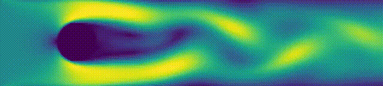

# Lattice Boltzmann Fluid Simulation (2D)

This project implements a 2D fluid simulation using the **Lattice Boltzmann Method (LBM)**. The code is written in NumPy and PyTorch to demonstrate the speed-up of GPU vs. CPU for this method. 

It is designed to simulate fluid flow around obstacles defined by a binary geometry mask and can be used for studying flow patterns, wake formation, and basic fluid dynamics behavior.



---

## 🌊 What this simulation does

The simulation models how a fluid moves through a 2D grid containing obstacles (e.g. cylinders, walls, arbitrary shapes).  

You provide:

- A 2D grid with a geometry mask as a numpy array of shape `(nx, ny)`
  - `0` → fluid
  - `1` → solid obstacle

- The `inlet velocity u0` in lattice units. 
  - Note that for computational stability, this needs to be well below the speed of sound, which is `1/sqrt(3) ≈ 0.577` in LBM. 
- The `kinematic viscosity ν` of the fluid. 
  - This is used to compute the relaxation parameter `τ = 0.5 + 3 ν`. 
  - Alternatively, you can directly provide the relaxation parameter `τ`. 

These inputs determine the system sufficiently. 

The output is:
- Fluid velocity field over time T with `u.shape == (T, nx, ny, 2)`
- Density field over time T with `rho.shape == (T, nx, ny)`

---

## 🧪 What the simulation produces

From this process, we recover:

- **Velocity field** (how fast the fluid moves)
- **Density field** (local pressure proxy)
- **Vorticity** (rotation / swirling motion)

These allow visualization of:
- flow separation
- vortex shedding
- wake formation behind obstacles

---

## 🚄 Quick Start

**Note:** If you don't use `uv`, replace all instances of `uv run` with `python` or `python3`, depending on your system. 

### 1. Install dependencies

To run the simulation and visualisation scripts, you need `numpy`, `matplotlib` and `tqdm`, along with the `PyTorch` version matching your system's CUDA version. 

For detailed information how to install dependencies, check the section on [Install dependencies](1-install-dependencies-2). 

### 2. Generate simulation data

```bash
uv run run_generate_data.py torch --device=cuda --steps=12000 --burn_in=9000
```

This:
- runs the simulation on GPU
- allows sufficient burn-in for vortex shedding to stabilize
- saves the velocity field to

```
outputs/data/u.npy
```

### 3. Create a video

```bash
uv run run_make_video.py
```

This loads the saved data at `outputs/data/u.npy` and generates

```
outputs/videos/lbm_velocity_vorticity.mp4
```

### 4. Generate a single snapshot

```bash
uv run run_make_image.py torch --device=cuda --steps=12000
```

This runs the simulation on the GPU and produces an image of the last step at:

```
outputs/images/lbm_velocity_vorticity.png
```

---

## 🧠 Intuition: How LBM works

Instead of solving complex fluid equations directly, the Lattice Boltzmann Method models the fluid as a large number of small “particles” moving on a grid.

At every time step, each grid cell holds a set of values representing particles moving in different directions.

The simulation repeats the following steps:

---

### 1. Streaming (movement step)

Each particle moves one grid cell in its direction.

### 2. Boundary handling

Special rules are applied at:
- obstacles (bounce-back → particles reflect)
- inlets (inflow velocity specified)
- outlets (pressure or zero-gradient conditions)

### 3. Calculating Macrosopic Quantities

Macroscopic quantities are calculated from the microscopic and are required for the collision step. 

- Velocity `u` emerges as a weighted average of particle directions per cell
- Density `rho` emerges as the sum of all particle populations in a cell

### 4. Collision (interaction step)

After moving, particles in the same cell “interact” and redistribute themselves.

This step ensures:
- momentum is conserved
- the fluid behaves realistically (viscosity, pressure effects)


---

### Why this works

Although simple locally, the repeated application of:
- streaming (local movement)
- collision (local relaxation)

**leads to emergent behavior that matches real fluid dynamics.**


---

## 🧮 Numerical representation

The simulation runs on a discrete grid:

- Space is discretized into cells
- Time advances in fixed steps
- Each cell stores 9 directional populations (D2Q9 model)

This makes the method:
- simple to implement
- highly parallel
- well-suited for GPUs

---

## 🚀 GPU acceleration (PyTorch version)

### Why GPU helps

LBM is extremely well-suited for GPUs because:

- Each grid cell is updated independently
- Most operations are local and repetitive
- Computation is mostly array-based

This means:
> The simulation can be parallelized almost perfectly across thousands of GPU cores.

---

### CPU (NumPy) vs GPU (PyTorch)

| Feature | NumPy (CPU) | PyTorch (GPU) |
|--------|-------------|----------------|
| Speed | moderate | very high (20×–200×) |
| Grid size | limited | large-scale simulations |
| Memory bandwidth | CPU-limited | GPU-optimized |
| Real-time visualization | difficult | feasible |
| Scaling to 3D | slow | practical |

---

### What moves to the GPU

In the PyTorch version, the following are executed on GPU:

- Distribution function update (`f`)
- Streaming step (tensor shifts)
- Collision step (local tensor math)
- Macroscopic variable computation (`rho`, `u`)
- Boundary conditions

Only visualization and file I/O remain on CPU.

---

### Practical benefits

Using a GPU enables:

- higher resolution grids (e.g. 1000×400+)
- longer physical simulation times
- real-time interactive visualization possible

---

## ⚙️ How to use this repository

### 1. Install dependencies

#### Which CUDA version do I need?

Depending on your OS, you can check your CUDA version with one or more of the following

Command line:
```bash
nvcc --version
```
or
```bash
nvidia-smi
```
(look in the top right corner for your CUDA version)

Python:
```python
import torch
print(torch.version.cuda)   
  ```


#### Using `uv` (recommended)

To enable GPU support with PyTorch, install the PyTorch version matching the CUDA version of your system as an extra e.g. for CUDA 12.8:

```bash
uv sync --extra cu128
```

Available CUDA exras are defined in `pyproject.toml`. 

If your CUDA version is not listed, visit: 
https://pytorch.org/get-started/locally/
and add the appropriate dependency manually. 

Alternatively, if you do not care about your clone being adaptive to multiple CUDA versions, you can just install your PyTorch version with ```uv add``` or ```uv pip install```. 

#### Using `pip`

You can install core dependencies along with the PyTorch version matching your system's CUDA version listed in `pyproject.toml` with (e.g. for CUDA 12.8):

```bash
pip install .[cu128]
```

Alternatively, check https://pytorch.org/get-started/locally/ for the PyTorch version matching your system's CUDA version and add the respective command to the installation of the base dependencies. 

```bash
pip install numpy matplotlib tqdm
```


#### Using `conda`

Check https://pytorch.org/get-started/locally/ for the PyTorch version matching your system's CUDA version and add the respective command to the installation of the base dependencies. 

```bash
conda install numpy matplotlib tqdm 
```


### 2. The LBM Simulation

The files `lattice_boltzmann.numpy.py` and `lattice_boltzmann.torch.py` each provide the class `LatticeBoltzmann2D`, which can run the simulation. 

- Simulation parameters (_defaults are set to produce vortex shedding, given enough time._):
  - `geometry`: A boolean NumPy array of shape `(nx, ny)` where `0` represents fluid and `1` represents a solid obstacle. 
    - _Note: The cylinder geometry is conveniently generated by the function `cylinder` in the script `geom_cylinder.py`._
  - `u0`: Inlet velocity in x-direction (flow direction) in lattice units. Default is `0.06`.
  - `nu`: Kinematic viscosity of the fluid in lattice units. Default is `0.02`.
  - `tau`: Relaxation parameter. _Only used as an alternative input to --nu and will overwrite it_. Default is `None`. 

- PyTorch version only:
  - `device`: `cpu` or `cuda`. Default is `cpu`. 
  - `dtype`: `torch.float32` can be used to speed up the simulation without perceivable quality loss. Default is `torch.float64`. 


### 3. Visualization Scripts

Data / video / image files are saved into following folder structure.

```
outputs/
├── data/
├── videos/
└── images/
```

These folders will be created when first running the respective script.

1. `run_generate_data.py` is a script that runs a LBM simulation and periodically saves intermediate outputs as a numpy file. 

Command line arguments:
- Set up arguments (_defaults are minimal. Should be manually set._):
  - backend: `numpy` or `torch`. Default is `numpy`. 
  - --device: `cpu` or `cuda`. Only relevant when using `torch` as backend. Default is `cpu`. 
  - --steps: Number of simulation steps to run. Default is `1000`. 
    - **Note that 1000 is not enough to produce vortex shedding. Vortex shedding begins at around 8000-10000.**
  - --burn_in: Number of burn-in steps before saving output. Default is 0. 
    - _Note that this default is only set to 0 to prevent confusion when expecting a full simulation when not specifying a burn in period. To develop vortex shedding, the simulation requires a considerable burn in period of at least 8000._

- Simulation arguments (_defaults are set to produce vortex shedding, given enough time._):
  - --nx: Domain size in x-direction. Default is `400`.
  - --ny: Domain size in y-direction. Default is `100`. 
  - --u0: Inlet velocity in x-direction (flow direction) in lattice units. Default is `0.06`.
  - --nu: Kinematic viscosity of the fluid in lattice units. Default is `0.02`.
  - --tau: Relaxation parameter. _Only used as an alternative input to --nu and will overwrite it if set_. Default is `None`. 

- Save output arguments:
  - --save_every: Save output every N steps. Default is `10`. 
  - --output_filename_u: Output filename for velocity field u. Default is `u.npy`.
  - --output_filename_geometry: Output filename for geometry. If `None`, geometry is **not** saved. Default is `None`.
  - --output_filename_rho: Output filename for density field rho. If `None`, rho is **not** saved. Default is `None`.


Example: 
```
uv run run_generate_data.py torch --device=cuda --steps=12000 --burn_in=9000
```
--> will run the simulation with default parameters on the gpu for long enough to produce vortex shedding. Will save to `output/data/u.npy`.

--

2. `run_make_video.py` is a script that takes the output of `run_generate_data.py` and renders it into an mp4 video. 

Command line arguments:
- --output_filename: Output filename for video. Default is `lbm_velocity_vorticity.mp4`.
- --input_filename_u: Input filename for velocity field u. Default is `u.npy`. 
- --t_start: Time slice to start the video from. Default is `0`. 
  - _Note that if you save the data with e.g. --save_every=10, then setting --t_start=50 means the video starts at the 50th saved slice which is the 500th time step of the simulation._
- --t_end: Time slice to end the video at. Default is `None`, which relates to the last slice. 

Example: 
```
uv run run_make_video.py
```
--> will take the file `outputs/data/u.npy` and make a video of all its time slices, saving the result to `outputs/videos/lbm_velocity_vorticity.mp4`.

--

3. `run_make_image.py` is a script that runs a LBM simulation and produces a png file of the final output. 

Command line arguments:
- backend: `numpy` or `torch`. Default is `numpy`. 
- --device: `cpu` or `cuda`. Only relevant when using `torch` as backend. Default is `cpu`. 
- --steps: Number of simulation steps to run. Default is `1000`. 
  - **Note that 1000 is not enough to produce vortex shedding. Vortex shedding begins at around 8000-10000.**
- --output_filename: Output filename for video. Default is `lbm_velocity_vorticity.png`.
- --u0: Inlet velocity in x-direction (flow direction) in lattice units. Default is `0.06`.
- --nu: Kinematic viscosity of the fluid in lattice units. Default is `0.02`.
- --tau: Relaxation parameter. _Only used as an alternative input to --nu and will overwrite it_. Default is `None`. 
- --nx: Domain size in x-direction. Default is `400`.
- --ny: Domain size in y-direction. Default is `100`. 
- --velocity_streamplot: Boolean flag to overlay the velocity plot with a streamplot. 

Example: 
```
uv run run_make_image.py torch --device=cuda --steps=12000
```
--> will run the simulation with default parameters on the gpu for long enough to produce vortex shedding. Will save the snapshot of the last step to `output/images/lbm_velocity_vorticity.png`.

### Utility scripts

- `geom_cylinder.py` provides a function to generate a discrete 2D grid with a round obstacle. 

---

## 📊 Summary

This project demonstrates how complex fluid behavior can be simulated using a simple rule-based model on a grid.  

The Lattice Boltzmann Method is powerful because it:
- avoids solving global equations
- relies only on local interactions
- scales extremely well with parallel hardware

GPU acceleration makes it practical for large-scale and real-time simulations.

LBM is fast and simple to parallelize, especially on GPUs, while it is not as flexible and accurate for for high-speed or engineering-critical flows as traditional CFD is.
